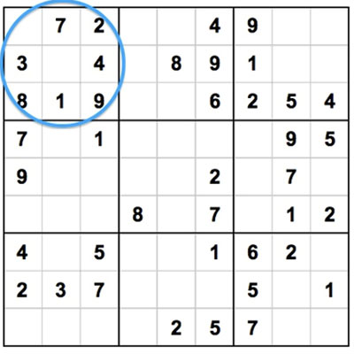

# SudokuGame
## My Sudoku Game, made using C++

Hello! This is my Sudoku Game I've built using mainly C++ to run the logic. 

# Here's the download link:
 
[Click Me for game installer!](https://github.com/TheYeetMeister/SudokuGame/releases/download/Game/SudokuGameInstaller.exe)

If you've never played Sudoku, here's a list of the rules that you follow:

## Sudoku Rules
### Sudoku Rule № 1: Use Numbers 1 - size of singluar macro grid squared
Sudoku is typically played on a grid of 9 x 9 spaces. Within the rows and columns are 9 “squares” (made up of 3 x 3 spaces). Each row, column and square (9 spaces each) needs to be filled out with the numbers 1-9, without repeating any numbers within the row, column or square. Does it sound complicated? As you can see from the image below of an actual Sudoku grid, each Sudoku grid comes with a few spaces already filled in; the more spaces filled in, the easier the game – the more difficult Sudoku puzzles have very few spaces that are already filled in.

Though because of the way I have structured the program of my game you can actually alter the size of your Sudoku board! Notice how I say, macro grid, if you look to the board the at the bottom you'll notice that there are gray small boxes, and large black boxes, the large "black" boxes are what I refer to as "macro grids" as they are the larger grids that are used by the game to make sure there aren't any repeat numbers within those larger grids. They will also be used as reference to determine the size of the grid, so asking for a board with a macro grid size of 3, would factor into a macro grid that is 3x3 = 9, which then gives the board all the values it will use, 1-9, as well as the size of the column and rows, 9x9, making the entire board the size of 9x9. This words for a macro grid size of 4x4, which leads to a board size of 16x16 and so on and so forth.

#### for possible reference
MacroGrid: The size of one of the larger grids, can be seen outlined in black in the image below

### Sudoku Rule № 2: Don’t Repeat Any Numbers
Sudoku is played in such a way that in a given coordinate, there should not be a repeat number in either the column, row, or general larger grid.

Here's an example:

As you can see, in the upper left square (circled in blue), this square already has 7 out of the 9 spaces filled in. The only numbers missing from the square are 5 and 6. By seeing which numbers are missing from each square, row, or column, we can use process of elimination and deductive reasoning to decide which numbers need to go in each blank space.

For example, in the upper left square, we know we need to add a 5 and a 6 to be able to complete the square, but based on the neighboring rows and squares we cannot clearly deduce which number to add in which space. This means that we should ignore the upper left square for now, and try to fill in spaces in some other areas of the grid instead.

### Sudoku Rule № 3: Don’t Guess

Sudoku is mainly a game of deduction, logic, and reasoning so there really shouldn't be much need to guess. If ever there is uncertainity or ambiguity with a square you can always look to other areas of the board and see where some numbers can or can not be in, using this knowledge to build back towards that inital unknown square. however, there shouldn't have a need to force anything, Sudoku is a game that rewards you for your patience, clarity, and understanding of patterns not through pure luck and assumptions.

### Sudoku Rule № 4: Utilize Deductive reasoning

You can always refer to the position of other numbers to work out 